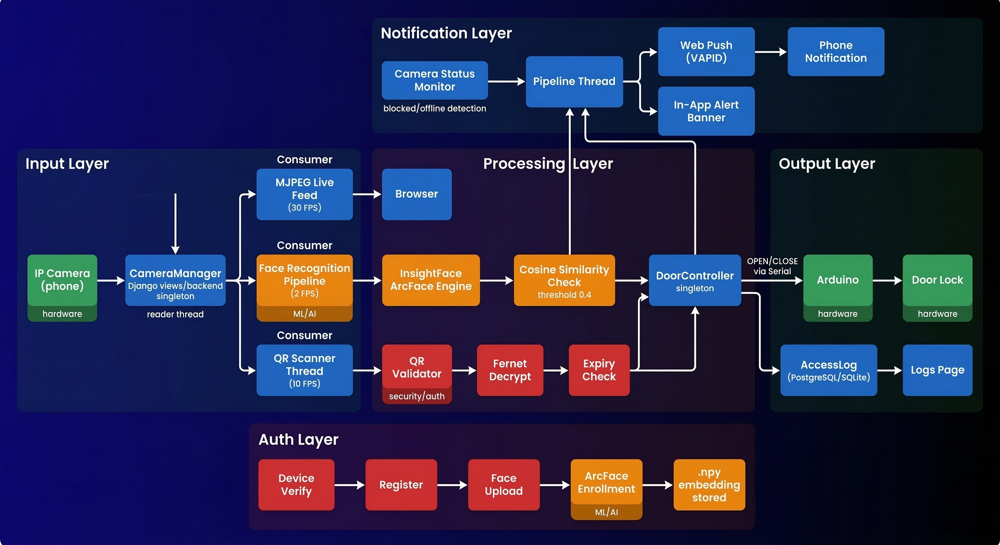
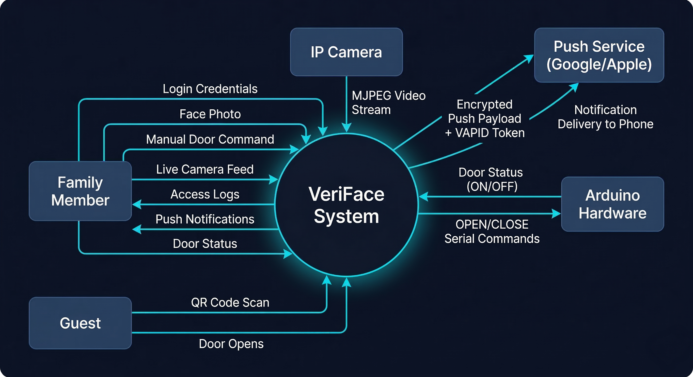
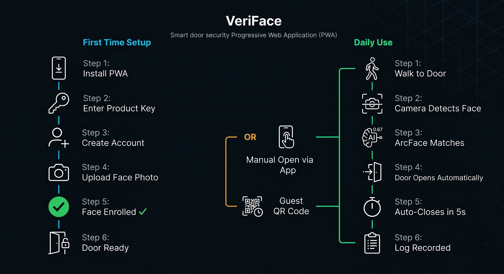
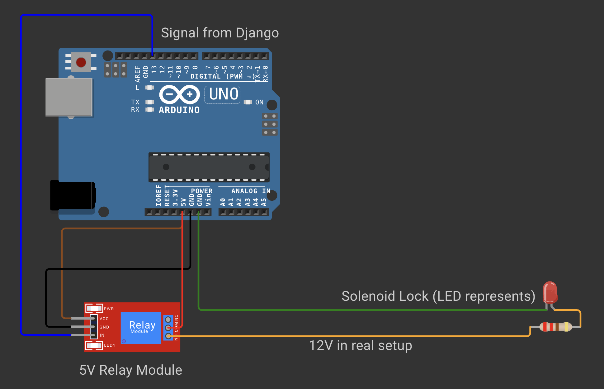

# VeriFace
### Your identity. Your door. VeriFace.

---

## Table of Contents

- [Features](#features)
- [Tech Stack](#tech-stack)
- [System Architecture](#system-architecture)
- [Data Flow](#data-flow)
- [User Journey](#user-journey)
- [Hardware Setup](#hardware-setup)
- [Hardware Demo](#hardware-demo)
- [Prerequisites](#prerequisites)
- [Installation](#installation)
- [Configuration](#configuration)
- [Running the App](#running-the-app)
- [Installing as PWA](#installing-as-pwa)
- [Arduino Setup](#arduino-setup)
- [Camera Setup](#camera-setup)
- [Project Structure](#project-structure)
- [Environment Variables](#environment-variables)
- [Troubleshooting](#troubleshooting)
- [Future Scope](#future-scope)
- [License](#license)

---

## Features

- **Face Recognition Door Unlock** — ArcFace 512-d embeddings with cosine similarity. Single photo enrollment. Auto-opens door, auto-closes after 5 seconds.
- **Live CCTV Feed** — MJPEG stream at 30 FPS. Supports any IP camera app (DroidCam, IP Webcam, AirDroid) or laptop webcam.
- **Manual Door Control** — Toggle door open/close from anywhere via the app.
- **QR Guest Access** — Encrypted, time-limited QR codes for guests. Count-limited or unlimited entries. Per-QR Fernet encryption. Device-scoped.
- **Access Logs** — Every face detection, QR scan, and manual action logged with photo, timestamp, and access type.
- **Camera Blocked Alerts** — Detects when camera is physically covered. Sends push notification + in-app banner.
- **Web Push Notifications** — VAPID-based push via browser. Works even when app is closed.
- **PWA — Installable on Phone** — Works as a native-feeling app on Android and iPhone. Portrait-only, mobile-first.
- **Multi-User Household** — Up to 5 family members per device. First member is owner with admin rights.
- **Owner Controls** — Only owner can generate guest QRs and revoke access.
- **Simulation Mode** — Runs without Arduino hardware. Door commands print to terminal.
- **Auto Arduino Detection** — Automatically detects Arduino port on startup.
- **SQLite or PostgreSQL** — Switch via `.env`. SQLite works out of the box.

---

## Tech Stack

| Layer | Technology |
|-------|-----------|
| Backend | Django 5.2, Python 3.10 |
| Face Recognition | InsightFace ArcFace (buffalo_l), ONNX Runtime |
| Computer Vision | OpenCV |
| Hardware | Arduino Uno + relay module + door lock |
| Database | SQLite (default) / PostgreSQL |
| Encryption | Fernet (cryptography library) |
| Push Notifications | Web Push API + VAPID (pywebpush) |
| Camera | Any MJPEG stream — DroidCam, IP Webcam, AirDroid, or laptop webcam |
| Frontend | Django Templates, Vanilla CSS/JS, PWA |
| Fonts | Syne, JetBrains Mono, Inter |

---

## System Architecture



The system runs four independent background threads:

- **CameraManager** — One reader thread per camera. Continuously pulls frames, stores latest in memory. Detects blocked/offline via pixel variance analysis.
- **Recognition Pipeline** — Per-device thread at 2 FPS. Loads all enrolled family embeddings, compares each frame using ArcFace cosine similarity.
- **QR Scanner** — Per-device thread at 10 FPS. Decrypts and validates QR codes using per-guest Fernet keys.
- **Notification Thread** — Fires on face match, QR access, and camera status changes via Web Push.

---

## Data Flow



---

## User Journey



---

## Hardware Setup



**Wiring:**

| Relay Module | Arduino UNO |
|-------------|-------------|
| VCC | 5V |
| GND | GND |
| IN | Pin 13 |

| Relay Module | Door Lock |
|-------------|-----------|
| COM | 12V Power Supply + |
| NO | Lock + |
| — | Lock - → Power Supply - |

> In the circuit diagram, an LED represents the solenoid lock. In real deployment, a 12V solenoid lock connects to the relay COM and NO terminals via a separate 12V power supply.

**Interactive circuit simulation:** [View on Wokwi](https://wokwi.com/projects/458927168826552321)

---

## Hardware Demo

https://github.com/ViralKariya-VK/VeriFace-Smart-Access-System/static/images/Working.mp4

---

## Prerequisites

- Mac, Linux, or Windows
- Python 3.10+
- Conda (recommended) or virtualenv
- Arduino Uno + relay module + door lock *(optional — simulation mode works without)*
- Any IP camera app on your phone OR laptop webcam

---

## Installation

### 1. Clone the repo

```bash
git clone https://github.com/ViralKariya-VK/VeriFace-Smart-Access-System.git
cd VeriFace-Smart-Access-System
```

### 2. Create conda environment

```bash
conda create -n veriface python=3.10
conda activate veriface
```

### 3. Install dependencies

**Mac (Apple Silicon — M1/M2/M3/M4):**
```bash
brew install cmake
pip install django python-decouple insightface onnxruntime opencv-python-headless \
    pillow pyserial cryptography qrcode psycopg2-binary numpy pywebpush py-vapid
```

**Linux / Intel Mac / Windows:**
```bash
pip install django python-decouple insightface onnxruntime opencv-python-headless \
    pillow pyserial cryptography qrcode psycopg2-binary numpy pywebpush py-vapid
```

### 4. Generate VAPID keys

```bash
python -c "
from py_vapid import Vapid
import base64

v = Vapid()
v.generate_keys()

pub_key = v.public_key.public_bytes(
    __import__('cryptography.hazmat.primitives.serialization', fromlist=['Encoding','PublicFormat']).Encoding.X962,
    __import__('cryptography.hazmat.primitives.serialization', fromlist=['Encoding','PublicFormat']).PublicFormat.UncompressedPoint
)
pub_b64 = base64.urlsafe_b64encode(pub_key).decode().rstrip('=')
priv_key = v.private_pem().decode().strip().replace('\n', '\\\\n')

print('VAPID_PUBLIC_KEY=' + pub_b64)
print('VAPID_PRIVATE_KEY=' + priv_key)
"
```

Copy both values for the next step.

### 5. Configure environment

```bash
cp .env.example .env
```

Edit `.env` with your values — see [Environment Variables](#environment-variables) for the full reference.

### 6. Run migrations

```bash
python manage.py migrate
```

### 7. Create superuser

```bash
python manage.py createsuperuser
```

### 8. Create your first device

Start the server:
```bash
python manage.py runserver
```

Open `http://localhost:8000/admin` and create a Device:

| Field | Value |
|-------|-------|
| Device ID | `DOOR-001` (this is your product key) |
| Name | `Front Door` |
| IP Address | Your machine's local IP |
| Camera Source | `0` for laptop webcam, or full stream URL for IP camera |
| Is Active | ✓ checked |

### 9. Register your account

Go to `http://localhost:8000/verify-device/`, enter `DOOR-001` as the product key and follow the registration flow. The first person to register on a device becomes the owner automatically.

---

## Configuration

### `.env.example`

```env
SECRET_KEY=
DEBUG=True
ALLOWED_HOSTS=*
CSRF_TRUSTED_ORIGINS=http://localhost:8000

# Database — sqlite or postgresql
DB_ENGINE=sqlite

# PostgreSQL (only if DB_ENGINE=postgresql)
DB_NAME=
DB_USER=
DB_PASSWORD=
DB_HOST=localhost
DB_PORT=5432

# Arduino — set to 'auto' for automatic detection
ARDUINO_PORT=auto
ARDUINO_BAUDRATE=9600

# Push notifications
VAPID_PUBLIC_KEY=
VAPID_PRIVATE_KEY=
VAPID_CLAIMS_EMAIL=

# App config
MAX_FAMILY_MEMBERS=5
FACE_SIMILARITY_THRESHOLD=0.6
```

---

## Running the App

**Local only:**
```bash
python manage.py runserver 0.0.0.0:8000
```

Access on your phone (same WiFi network):
```
http://YOUR_IP:8000
```

Find your IP:
```bash
ipconfig getifaddr en0   # Mac
ip route get 1 | awk '{print $7}'  # Linux
```

**With push notifications (requires HTTPS):**
```bash
# Terminal 1
python manage.py runserver 127.0.0.1:8000

# Terminal 2
ngrok http 8000
```

Update `.env`:
```
CSRF_TRUSTED_ORIGINS=https://your-ngrok-url.ngrok-free.app
```

Restart Django and open the ngrok URL on your phone.

---

## Installing as PWA

**Android (Chrome):**
1. Open the app URL in Chrome
2. Three dots menu → Add to Home Screen

**iPhone (Safari):**
1. Open the app URL in Safari
2. Share button → Add to Home Screen

> PWA install requires HTTPS. Use ngrok for local development.

---

## Arduino Setup

### Upload the sketch

Open `assets/Arduino/sketch/sketch.ino` in Arduino IDE and upload to your Uno.

The sketch listens for three serial commands:

| Command | Action | Response |
|---------|--------|----------|
| `OPEN` | Pin 13 HIGH → relay energizes → lock opens | `Device is ON` |
| `CLOSE` | Pin 13 LOW → relay de-energizes → lock closes | `Device is OFF` |
| `STATUS` | Reads current pin state | `ON` or `OFF` |

### Port detection

VeriFace auto-detects the Arduino port on startup. Set `ARDUINO_PORT=auto` in `.env`.

To specify manually:
```
ARDUINO_PORT=/dev/tty.usbserial-1120   # Mac
ARDUINO_PORT=/dev/ttyACM0              # Linux
ARDUINO_PORT=COM3                       # Windows
```

---

## Camera Setup

### Option 1 — Laptop webcam
Set `camera_source` to `0` in Django admin.

### Option 2 — Phone as IP camera

| App | Platform | Stream URL |
|-----|----------|------------|
| DroidCam | Android / iOS | `http://PHONE_IP:4747/video` |
| IP Webcam | Android | `http://PHONE_IP:8080/video` |
| AirDroid | Android / iOS | `http://PHONE_IP:4747/video` |

Set `camera_source` to the full stream URL in Django admin.

---

## Project Structure

```
veriface/
├── .env                    # Secrets and config (never commit)
├── .env.example            # Template for setup
├── manage.py
│
├── config/                 # Django project settings
│   ├── settings.py
│   ├── urls.py
│   └── wsgi.py
│
├── apps/
│   ├── core/               # Models, admin, startup cleanup command
│   ├── auth_app/           # Registration, login, logout
│   ├── camera/             # CameraManager, live feed, MJPEG stream
│   ├── door/               # Arduino control, simulation mode
│   ├── recognition/        # InsightFace ArcFace, recognition pipeline
│   ├── guest/              # QR generation, QR scanner thread
│   └── notifications/      # Web Push, VAPID, push subscriptions
│
├── templates/
│   ├── base.html           # App shell (header + footer nav)
│   ├── landing.html
│   ├── auth/               # Login, register, verify device, upload face
│   └── app/                # Live feed, door control, QR, logs, profile
│
├── static/
│   ├── css/style.css       # Design system — industrial security × luxury tech
│   ├── js/app.js           # Camera status polling + push notification setup
│   ├── js/sw.js            # Service worker (PWA + push handler)
│   ├── manifest.json       # PWA manifest
│   └── images/             # Architecture and flow diagrams
│
└── assets/
    └── Arduino/
        └── sketch/
            └── sketch.ino  # Arduino firmware
```

---

## Environment Variables

| Variable | Description | Default |
|----------|-------------|---------|
| `SECRET_KEY` | Django secret key | Required |
| `DEBUG` | Debug mode | `True` |
| `ALLOWED_HOSTS` | Comma-separated allowed hosts | `*` |
| `CSRF_TRUSTED_ORIGINS` | Trusted origins — include ngrok URL | Required |
| `DB_ENGINE` | `sqlite` or `postgresql` | `sqlite` |
| `DB_NAME` | PostgreSQL database name | — |
| `DB_USER` | PostgreSQL username | — |
| `DB_PASSWORD` | PostgreSQL password | — |
| `DB_HOST` | PostgreSQL host | `localhost` |
| `DB_PORT` | PostgreSQL port | `5432` |
| `ARDUINO_PORT` | Serial port or `auto` | `auto` |
| `ARDUINO_BAUDRATE` | Serial baudrate | `9600` |
| `VAPID_PUBLIC_KEY` | Web Push public key | Required for push |
| `VAPID_PRIVATE_KEY` | Web Push private key | Required for push |
| `VAPID_CLAIMS_EMAIL` | Your email for VAPID | Required for push |
| `MAX_FAMILY_MEMBERS` | Max users per device | `5` |
| `FACE_SIMILARITY_THRESHOLD` | ArcFace cosine threshold (0–1) | `0.6` |

---

## Troubleshooting

**Face not being recognized**
- Check server terminal for `🚀 Recognition pipeline started` — if missing, log out and back in
- Lower `FACE_SIMILARITY_THRESHOLD` to `0.55` in `.env`
- Re-enroll with a clearer, well-lit, front-facing photo

**Camera not opening**
- Verify `camera_source` in admin — `0` for webcam, full URL for IP camera
- Mac: grant camera permission to Terminal — System Settings → Privacy → Camera

**Arduino not connecting**
- App runs in simulation mode if Arduino not found — check terminal for confirmation
- Run `ls /dev/tty.usb*` (Mac) or `ls /dev/ttyACM*` (Linux) to find the port
- Set `ARDUINO_PORT=auto` and restart

**Push notifications not working**
- Must be on HTTPS — use ngrok
- Update `CSRF_TRUSTED_ORIGINS` in `.env` with current ngrok URL
- Grant notification permission in Chrome settings
- Open the app once after ngrok restart — it auto-resubscribes

**QR code not opening door**
- Check QR hasn't expired or hit use limit — visible in the guests list
- Camera feed must be live for QR scanner to work
- QR codes are device-scoped — only work on the device they were generated for

**Door not auto-closing**
- Check terminal for `Door auto-closed after 5 seconds`
- Auto-close is controlled by Django, not Arduino firmware

---

## Future Scope

- **Anti-Spoofing / Liveness Detection** — Prevent photo-based spoofing attacks. Explored MiniFASNet (Tencent) for passive liveness detection — requires fine-tuning on device-specific camera data to generalize across different hardware. Production solution would use IR depth sensors (Apple Face ID) or active challenge-response (Aadhaar eKYC approach).
- **Telegram Notifications** — Alternative push channel via Telegram Bot API.
- **Geofencing** — WiFi-based presence detection. Owner controls door from anywhere, family members restricted to home network.
- **IFTTT Webhooks** — Trigger smart home devices when door opens.
- **Face Clustering on Unknown Visitors** — DBSCAN on unrecognized face embeddings in access logs. Group repeated unknown visitors automatically without manual labeling.
- **Anomaly Detection on Access Patterns** — Isolation Forest on access timestamps and frequency. Flag unusual patterns like 3am entries or rapid repeated attempts.
- **Multi-Photo Enrollment** — Average embeddings from 3–5 photos for better accuracy across lighting conditions.
- **Docker Compose** — One-command deployment.

---

## License

MIT License — use freely, attribution appreciated.

---

*Built by [Viral Kariya](https://github.com/ViralKariya-VK)*