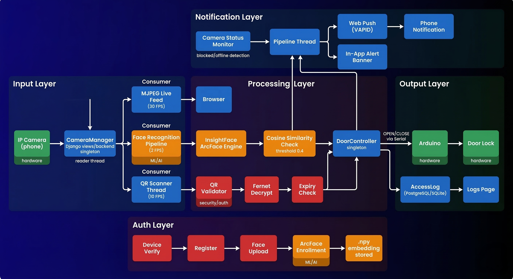
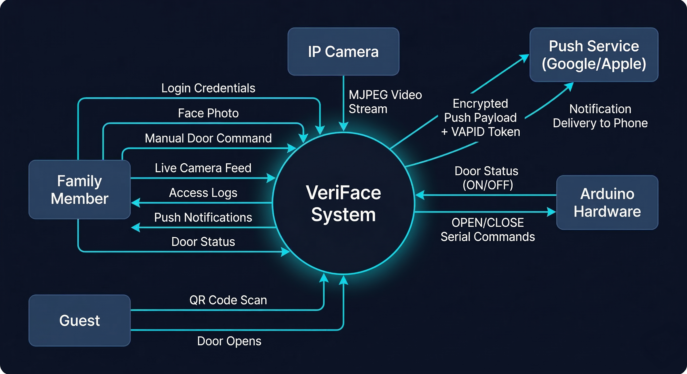
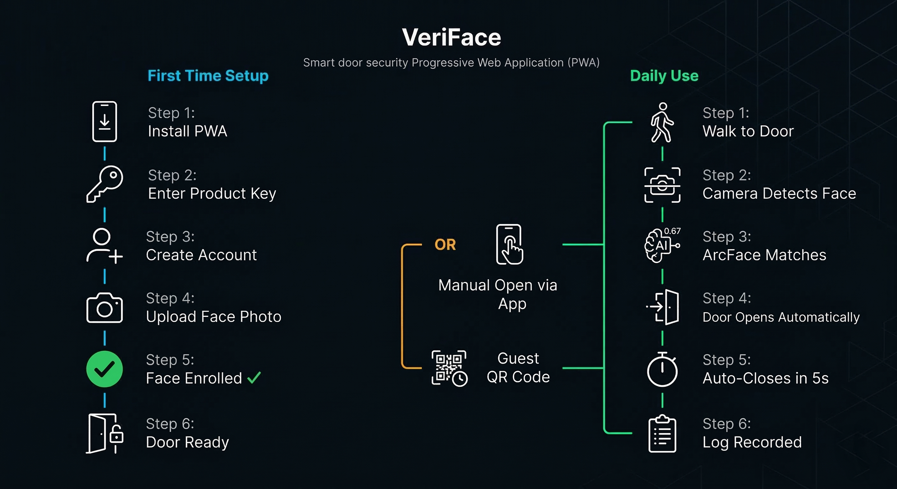
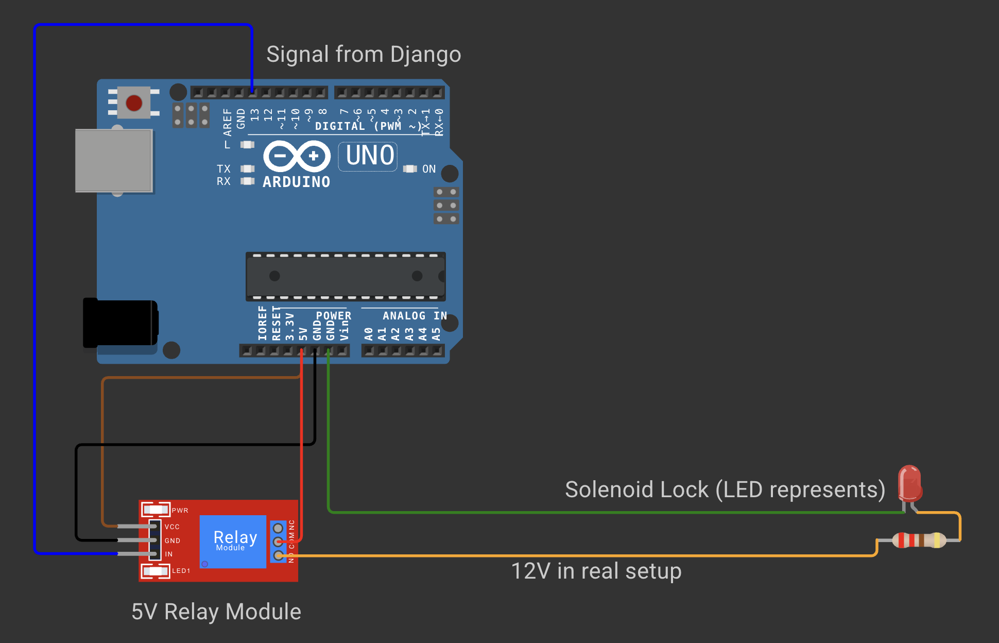

# VeriFace
### Your identity. Your door. VeriFace.

A face-recognition door lock that works with the CCTV camera you already have. Self-hosted, free to run, with an Android app — install it with one `docker compose up`.

---

---

## Table of Contents

- [Features](#features)
- [Tech Stack](#tech-stack)
- [System Architecture](#system-architecture)
- [Data Flow](#data-flow)
- [User Journey](#user-journey)
- [Hardware Setup](#hardware-setup)
- [Hardware Demo](#hardware-demo)
- [Getting Started (Docker)](#getting-started-docker)
- [Android app (APK)](#android-app-apk)
- [Connecting your CCTV camera](#connecting-your-cctv-camera)
- [Access from anywhere (free)](#access-from-anywhere-free)
- [Arduino Setup](#arduino-setup)
- [Installing as PWA](#installing-as-pwa)
- [Run without Docker (development)](#run-without-docker-development)
- [Security notes](#security-notes)
- [Project Structure](#project-structure)
- [Environment Variables](#environment-variables)
- [Troubleshooting](#troubleshooting)
- [Future Scope](#future-scope)
- [License](#license)

---

## Features

- **Face Recognition Door Unlock** — ArcFace 512-d embeddings with cosine similarity. Single photo enrollment. Auto-opens door, auto-closes after 5 seconds.
- **Live CCTV Feed** — MJPEG stream at 30 FPS. Works with any RTSP CCTV / IP camera, phone camera apps (DroidCam, IP Webcam, AirDroid) or a USB webcam. Reconnects on its own if the stream drops.
- **Manual Door Control** — Toggle door open/close from anywhere via the app.
- **QR Guest Access** — Encrypted, time-limited QR codes for guests. Count-limited or unlimited entries. Per-QR Fernet encryption. Device-scoped.
- **Access Logs** — Every face detection, QR scan, and manual action logged with photo, timestamp, and access type. Filter by All / Granted / Unknown.
- **Unknown-Visitor Alerts** — An unrecognised face at the door is snapshotted and you're notified. One alert per visit (a lingering visitor doesn't spam you); switch it off in *Manage*.
- **Owner Management** — Change the camera, remove members (their photo and face data are deleted) and clear logs from the app — no admin panel.
- **Camera Blocked Alerts** — Detects when camera is physically covered. Sends push notification + in-app banner.
- **Web Push Notifications** — VAPID-based push via browser. Works even when app is closed.
- **Android App (APK)** — Download from GitHub Releases. Finds your server on the Wi-Fi, takes the enrolment selfie, and shows native notifications.
- **PWA — Installable on Phone** — Works as a native-feeling app on Android and iPhone. Portrait-only, mobile-first.
- **Multi-User Household** — Up to 5 family members per device. First member is owner with admin rights.
- **Owner Controls** — Only owner can generate guest QRs and revoke access.
- **Simulation Mode** — Runs without Arduino hardware. Door commands print to terminal.
- **Auto Arduino Detection** — Automatically detects Arduino port on startup.
- **SQLite or PostgreSQL** — Switch via `.env`. SQLite works out of the box.
- **One-Command Install** — `docker compose up -d`. A first-run wizard sets up the camera and owner account; no admin panel or key generation. Recognition starts at boot, so the door works after a power cut.
- **Free Remote Access** — Optional Cloudflare Tunnel gives a secure HTTPS address without opening router ports.

---

## Tech Stack

| Layer | Technology |
|-------|-----------|
| Backend | Django 5.2, Python 3.10 |
| Face Recognition | InsightFace ArcFace (buffalo_l), ONNX Runtime |
| Computer Vision | OpenCV |
| Hardware | Arduino Uno + relay module + door lock |
| Database | SQLite (default) / PostgreSQL |
| Encryption | Fernet (cryptography library) |
| Push Notifications | Web Push API + VAPID (pywebpush) |
| Camera | RTSP / MJPEG streams (CCTV, DroidCam, IP Webcam, AirDroid) or USB webcam |
| Frontend | Django Templates, Vanilla CSS/JS, PWA |
| Android | Kotlin WebView shell, foreground alert service (no Firebase / Google account needed) |
| Deployment | Docker Compose, Gunicorn, WhiteNoise, Cloudflare Tunnel (optional) |
| Fonts | Syne, JetBrains Mono, Inter |

---

## System Architecture



The system runs four independent background threads:

- **CameraManager** — One reader thread per camera. Continuously pulls frames, stores latest in memory, and reconnects automatically if the stream drops. Detects blocked/offline via pixel variance analysis.
- **Recognition Pipeline** — Per-device thread at 2 FPS, started at boot for every active device. Reloads enrolled family embeddings every 30 s, compares each frame using ArcFace cosine similarity, and flags real but unrecognised faces as unknown visitors (de-duplicated, one alert per visit).
- **QR Scanner** — Per-device thread at 10 FPS. Decrypts and validates QR codes using per-guest Fernet keys.
- **Notification Thread** — Fires on face match, unknown visitor, QR access, and camera status changes. Every alert is stored as an event; browsers receive it via Web Push, and the Android app picks it up from the event feed.

---

## Data Flow



---

## User Journey



---

## Hardware Setup



**Wiring:**

| Relay Module | Arduino UNO |
|-------------|-------------|
| VCC | 5V |
| GND | GND |
| IN | Pin 13 |

| Relay Module | Door Lock |
|-------------|-----------|
| COM | 12V Power Supply + |
| NO | Lock + |
| — | Lock - → Power Supply - |

> In the circuit diagram, an LED represents the solenoid lock. In real deployment, a 12V solenoid lock connects to the relay COM and NO terminals via a separate 12V power supply.

**Interactive circuit simulation:** [View on Wokwi](https://wokwi.com/projects/458927168826552321)

---

## Hardware Demo

https://github.com/user-attachments/assets/a58dff77-37c3-4e2e-bb75-64449179c435

---

## Getting Started (Docker)

VeriFace is meant to run **at home**, next to your camera and door lock — on a Raspberry Pi 4/5 (4 GB+), an old laptop or a mini PC. You need [Docker](https://docs.docker.com/get-docker/) and nothing else.

```bash
git clone https://github.com/ViralKariya-VK/VeriFace-Smart-Access-System.git
cd VeriFace-Smart-Access-System
docker compose up -d --build
```

Then open **http://\<this-machine\>:8000** from a phone or laptop on the same Wi-Fi. A setup wizard walks you through it:

1. **Connect your camera** — paste its address and press *Test Camera* to see a live snapshot.
2. **Create the owner account** and enrol your face with one photo.
3. Add family members with the product key shown on the profile page (up to 5). The owner manages camera, members and alerts from *Profile → Manage door*.

That's it — no `.env`, no admin panel, no key generation. Secrets and push keys are generated on first run and stored in the `veriface-data` Docker volume together with the database and photos, so updates (`git pull && docker compose up -d --build`) keep everything.

Recognition runs **as soon as the container starts** — the door keeps working after a reboot or power cut, even if nobody opens the app.

> First-run setup is only available from your home network, so nobody on the internet can claim a fresh install.

**Useful commands**

```bash
docker compose logs -f veriface        # watch recognition + door activity
docker compose down                    # stop (data is kept in the volume)
VERIFACE_PORT=8080 docker compose up -d  # use a different port
```

---

## Android app (APK)

Download **`VeriFace-x.y.z.apk`** from the [latest release](https://github.com/ViralKariya-VK/VeriFace-Smart-Access-System/releases/latest) and open it on your phone (allow "install unknown apps" for your browser when asked). Android 7.0+.

The app is the phone-side of VeriFace — the server still runs at home (see [Getting Started](#getting-started-docker)).

1. Open the app. On first launch it **scans your Wi-Fi for the server** and connects automatically. If it can't find it (or you're away from home), type the address: `192.168.1.50:8000` or your tunnel URL `https://….trycloudflare.com`.
2. Set up your door, create your account and enrol your face — you can take the photo with the phone's selfie camera.
3. You get **native notifications** when the door opens, a guest uses a QR code, or the camera is blocked/offline. Manage them in *Profile → App Settings*. An unrecognised face at the door also triggers an alert.

If alerts stop arriving, open *App Settings → Battery settings* and let VeriFace run unrestricted — phone makers aggressively stop background apps.

**Building it yourself:** `cd android && ./gradlew assembleRelease` (JDK 17 + Android SDK 34). Unsigned-by-you builds use the debug key.

**Publishing a release (maintainers):** push a tag and GitHub Actions builds and attaches the APK.
```bash
git tag v1.0.0 && git push origin v1.0.0
```
Add these repository secrets once so every release is signed with the same key (otherwise phones refuse to *update* over an older install): `ANDROID_KEYSTORE_BASE64` (`base64 -i release.jks`), `ANDROID_KEYSTORE_PASSWORD`, `ANDROID_KEY_ALIAS`, `ANDROID_KEY_PASSWORD`. Keep the keystore file backed up — losing it means users must uninstall to update.

> There is no iPhone app yet — on iOS use the web app as a PWA (see [Installing as PWA](#installing-as-pwa)).

---

## Connecting your CCTV camera

Anything that speaks **RTSP** (nearly every CCTV / IP camera), an MJPEG/HTTP URL, or a USB webcam works. Use the *lower-resolution sub-stream* if your camera offers one — face recognition doesn't need 4K.

| Camera | Camera source |
|--------|---------------|
| Hikvision | `rtsp://user:pass@IP:554/Streaming/Channels/102` |
| Dahua / Amcrest | `rtsp://user:pass@IP:554/cam/realmonitor?channel=1&subtype=1` |
| Reolink | `rtsp://user:pass@IP:554/h264Preview_01_sub` |
| TP-Link Tapo | `rtsp://user:pass@IP:554/stream2` (create a *Camera Account* in the Tapo app) |
| Generic ONVIF | `rtsp://user:pass@IP:554/stream1` |
| Phone (IP Webcam) | `http://PHONE_IP:8080/video` |
| Phone (DroidCam / AirDroid) | `http://PHONE_IP:4747/video` |
| USB webcam (Linux) | `0` — see the `devices:` lines in `docker-compose.yml` |

Set the address in the setup wizard, and change it any time under *Profile → Manage door → Camera* (there's a **Test** button that shows a live snapshot).

The stream reconnects automatically if the camera or Wi-Fi drops. Docker Desktop on Mac/Windows can't pass USB devices through, so use an IP/RTSP camera there (or run natively, see [Run without Docker](#run-without-docker-development)).

**Door lock on Linux:** uncomment the `devices:` / `group_add:` lines in `docker-compose.yml` to hand `/dev/ttyACM0` to the container. Without hardware the app runs in simulation mode.

---

## Access from anywhere (free)

A cloud server can't see a camera inside your house, so VeriFace stays at home and a **free tunnel** gives it a secure public HTTPS address — no router ports opened. HTTPS is also what makes "Add to Home Screen" and push notifications work on phones.

**Quick, no account (URL changes if the tunnel restarts):**
```bash
docker compose --profile tunnel up -d
docker compose logs cloudflared | grep trycloudflare.com
```
Open that `https://….trycloudflare.com` address on your phone and add it to your home screen.

**Permanent URL (free Cloudflare account + a domain):** create a tunnel in the Cloudflare Zero Trust dashboard pointing at `http://veriface:8000`, put its token in `.env` as `TUNNEL_TOKEN=…`, then `docker compose --profile tunnel-named up -d`.

**Alternative:** [Tailscale Funnel](https://tailscale.com/kb/1223/funnel) (free) gives a stable `*.ts.net` HTTPS address with no domain needed.

After switching to an HTTPS address, set `SECURE_COOKIES=true` in `.env`.

**ngrok (alternative):** `ngrok http 8000` also works — add its URL to `CSRF_TRUSTED_ORIGINS` in `.env` if it isn't one of the already-allowed domains (`*.trycloudflare.com`, `*.ts.net`, `*.ngrok-free.app`).

---

## Arduino Setup

### Upload the sketch

Open `assets/Arduino/sketch/sketch.ino` in Arduino IDE and upload to your Uno.

The sketch listens for three serial commands:

| Command | Action | Response |
|---------|--------|----------|
| `OPEN` | Pin 13 HIGH → relay energizes → lock opens | `Device is ON` |
| `CLOSE` | Pin 13 LOW → relay de-energizes → lock closes | `Device is OFF` |
| `STATUS` | Reads current pin state | `ON` or `OFF` |

### Port detection

VeriFace auto-detects the Arduino port on startup. Set `ARDUINO_PORT=auto` in `.env`.

To specify manually:
```
ARDUINO_PORT=/dev/tty.usbserial-1120   # Mac
ARDUINO_PORT=/dev/ttyACM0              # Linux
ARDUINO_PORT=COM3                       # Windows
```

**In Docker:** the container can't see USB devices by default — uncomment the `devices:` / `group_add:` lines in `docker-compose.yml` (Linux hosts). Docker Desktop on Mac/Windows can't pass serial devices through; run natively there.

---

## Installing as PWA

**Android (Chrome):**
1. Open the app URL in Chrome
2. Three dots menu → Add to Home Screen

**iPhone (Safari):**
1. Open the app URL in Safari
2. Share button → Add to Home Screen

> PWA install requires HTTPS — use a tunnel (see [Access from anywhere](#access-from-anywhere-free)). Android users can install the [APK](#android-app-apk) instead; iPhone has no native app, so the PWA is the way.

---

## Run without Docker (development)

### Prerequisites

- Mac, Linux, or Windows
- Python 3.10+
- Conda (recommended) or virtualenv
- Arduino Uno + relay module + door lock *(optional — simulation mode works without)*
- Any IP camera app on your phone, an RTSP camera, OR a laptop webcam

### Installation

**1. Clone the repo**

```bash
git clone https://github.com/ViralKariya-VK/VeriFace-Smart-Access-System.git
cd VeriFace-Smart-Access-System
```

**2. Create conda environment**

```bash
conda create -n veriface python=3.10
conda activate veriface
```

**3. Install dependencies**

On Apple Silicon (M1–M4) install cmake first — `insightface` needs it to build:
```bash
brew install cmake
```
Then, on every platform:
```bash
pip install -r requirements.txt
```

**4. Configure environment** *(optional — everything has a working default)*

```bash
cp .env.example .env
```

See [Environment Variables](#environment-variables). Secret key and push-notification (VAPID) keys are generated automatically on first run and stored next to the database. To use your own VAPID keys:

<details>
<summary>Generate VAPID keys manually</summary>

```bash
python -c "
from py_vapid import Vapid
import base64

v = Vapid()
v.generate_keys()

pub_key = v.public_key.public_bytes(
    __import__('cryptography.hazmat.primitives.serialization', fromlist=['Encoding','PublicFormat']).Encoding.X962,
    __import__('cryptography.hazmat.primitives.serialization', fromlist=['Encoding','PublicFormat']).PublicFormat.UncompressedPoint
)
pub_b64 = base64.urlsafe_b64encode(pub_key).decode().rstrip('=')
priv_key = v.private_pem().decode().strip().replace('\n', '\\\\n')

print('VAPID_PUBLIC_KEY=' + pub_b64)
print('VAPID_PRIVATE_KEY=' + priv_key)
"
```
</details>

**5. Run it**

```bash
python manage.py migrate
DEBUG=True python manage.py runserver 0.0.0.0:8000
```

Open `http://localhost:8000` — the setup wizard creates your device and owner account. (Product keys are generated for you; the Django admin is not needed for setup. Use `python manage.py createsuperuser` only if you want `/admin`.)

### Reaching it from your phone

Same Wi-Fi: open `http://YOUR_IP:8000`. Find your IP:
```bash
ipconfig getifaddr en0             # Mac
ip route get 1 | awk '{print $7}'  # Linux
```
From anywhere, or for push notifications / PWA install (both need HTTPS), use a tunnel — see [Access from anywhere](#access-from-anywhere-free).

### Tests

```bash
python manage.py test apps.core.tests
```
After changing CSS/JS in Docker, rebuild (`docker compose up -d --build`) — static files are collected and fingerprinted at build time.

---

## Security notes

- Face photos, access-log snapshots and QR codes are only served to signed-in household members; face embeddings are never exposed over HTTP.
- Logins are rate-limited (5 failures → 15-minute lockout per user + address).
- `DEBUG` is off by default in the Docker image; it runs as a non-root user.
- Only the owner can reach the management screen; removing a member deletes their photo and face data.
- A face recognised from a **printed photo or phone screen** will currently still be accepted — liveness (anti-spoofing) is not enabled yet. Until it is, don't rely on VeriFace as your only lock on an exterior door; keep a physical key and place the camera out of reach.
- Keep the physical lock **fail-secure** and the 12V supply separate from the Arduino, as in the wiring diagram.

---

## Project Structure

```
veriface/
├── .env.example            # Optional settings template (never commit your .env)
├── Dockerfile              # Image: Python 3.10 + face model baked in
├── docker-compose.yml      # App + optional Cloudflare tunnel profiles
├── docker/entrypoint.sh    # migrate + gunicorn (single worker, threads)
├── manage.py
│
├── config/                 # Django project settings
│   ├── settings.py
│   ├── urls.py
│   └── wsgi.py
│
├── apps/
│   ├── core/               # Models, setup wizard, owner management, tests
│   ├── auth_app/           # Registration, login (rate-limited), logout
│   ├── camera/             # CameraManager (RTSP/MJPEG/webcam), live feed
│   ├── door/               # Arduino control, simulation mode
│   ├── recognition/        # InsightFace ArcFace, pipeline, access logs
│   ├── guest/              # QR generation, QR scanner thread
│   └── notifications/      # Web Push, VAPID, event feed for the Android app
│
├── templates/
│   ├── base.html           # App shell (header + footer nav)
│   ├── landing.html
│   ├── auth/               # Setup wizard, login, register, verify device, upload face
│   └── app/                # Live feed, door control, QR, logs, manage, profile
│
├── static/
│   ├── css/style.css       # Design system — industrial security × luxury tech
│   ├── js/app.js           # Camera status polling + push notification setup
│   ├── js/sw.js            # Service worker (PWA + push handler)
│   ├── manifest.json       # PWA manifest
│   └── images/             # Architecture and flow diagrams
│
├── android/                # Kotlin app (WebView shell + alert service)
├── .github/workflows/      # Builds + publishes the signed APK on version tags
│
└── assets/
    └── Arduino/
        └── sketch/
            └── sketch.ino  # Arduino firmware
```

---

## Environment Variables

All optional — see [`.env.example`](.env.example). With Docker, put them in a `.env` file next to `docker-compose.yml`.

| Variable | Description | Default |
|----------|-------------|---------|
| `VERIFACE_PORT` | Port exposed on the host (Docker) | `8000` |
| `CAMERA_SOURCE` | Create the door from env instead of the wizard (RTSP URL / webcam index) | — |
| `DEVICE_NAME` / `DEVICE_ID` | Name and product key for the env-created door | `Front Door` / generated |
| `SECRET_KEY` | Django secret key | Auto-generated, persisted |
| `DEBUG` | Debug mode | `False` |
| `ALLOWED_HOSTS` | Comma-separated allowed hosts | `*` |
| `CSRF_TRUSTED_ORIGINS` | Extra trusted origins (custom domain) | `*.trycloudflare.com`, `*.ts.net`, `*.ngrok-free.app` |
| `SECURE_COOKIES` | Mark cookies Secure — enable once HTTPS-only | `false` |
| `DATA_DIR` | Where DB, uploads and generated keys live | project dir (`/data` in Docker) |
| `DB_ENGINE` | `sqlite` or `postgresql` | `sqlite` |
| `DB_NAME` / `DB_USER` / `DB_PASSWORD` | PostgreSQL credentials | — |
| `DB_HOST` / `DB_PORT` | PostgreSQL host / port | `localhost` / `5432` |
| `ARDUINO_PORT` | Serial port or `auto` | `auto` |
| `ARDUINO_BAUDRATE` | Serial baudrate | `9600` |
| `VAPID_PUBLIC_KEY` / `VAPID_PRIVATE_KEY` | Web Push keys | Auto-generated, persisted |
| `VAPID_CLAIMS_EMAIL` | Your email for VAPID | `admin@example.com` |
| `MAX_FAMILY_MEMBERS` | Max users per device | `5` |
| `FACE_SIMILARITY_THRESHOLD` | ArcFace cosine threshold (0–1). Higher = stricter | `0.4` |
| `TUNNEL_TOKEN` | Cloudflare named-tunnel token | — |

---

## Troubleshooting

**Face not being recognized**
- Check `docker compose logs veriface` (or the server terminal) for `🔄 Pipeline loop running` and `📦 Loaded embedding` — recognition starts at boot, no login needed
- If the camera shows *offline* or *blocked* in the app, recognition is paused until it's back
- Raise or lower `FACE_SIMILARITY_THRESHOLD` (default `0.4`; lower is more lenient)
- Re-enroll with a clearer, well-lit, front-facing photo

**Camera not opening**
- Use *Profile → Manage door → Camera → Test* to see the exact error
- `0` for a USB webcam, the full `rtsp://…` / `http://…` URL for an IP camera (see the [camera table](#connecting-your-cctv-camera))
- In Docker, the container needs network access to the camera's IP; USB webcams need the `devices:` lines on Linux
- Mac (native run): grant camera permission to Terminal — System Settings → Privacy → Camera

**Android app can't find the server**
- Phone and server must be on the same Wi-Fi (guest networks often isolate devices)
- Auto-discovery looks on port `8000`; if you changed `VERIFACE_PORT`, type the address manually (`192.168.1.50:8080`)

**No alerts on Android**
- Allow notifications for VeriFace, then *App Settings → Battery settings* → unrestricted
- Alerts need you to have signed in once in the app; they stop if you sign out

**Unknown-visitor alerts feel noisy / missing**
- One alert is sent per visit; a different face within 20 s is still alerted separately
- Turn them off or on in *Manage door → Alerts*

**Arduino not connecting**
- App runs in simulation mode if Arduino not found — check terminal for confirmation
- Run `ls /dev/tty.usb*` (Mac) or `ls /dev/ttyACM*` (Linux) to find the port
- Set `ARDUINO_PORT=auto` and restart
- In Docker, pass the device through (Linux only) — see [Arduino Setup](#arduino-setup)

**Browser push notifications not working**
- Must be on HTTPS — use a tunnel
- Grant notification permission in Chrome settings
- Open the app once after the tunnel URL changes — it auto-resubscribes
- On Android, the APK's native notifications don't need any of this

**QR code not opening door**
- Check QR hasn't expired or hit use limit — visible in the guests list
- Camera feed must be live for QR scanner to work
- QR codes are device-scoped — only work on the device they were generated for

**Door not auto-closing**
- Check terminal for `Door auto-closed after 5 seconds`
- Auto-close is controlled by Django, not Arduino firmware

**"Can't log in" after several tries**
- Logins lock for 15 minutes after 5 failures per username + address

---

## Future Scope

- **Anti-Spoofing / Liveness Detection** — Prevent photo-based spoofing attacks. Explored MiniFASNet (Tencent) for passive liveness detection — requires fine-tuning on device-specific camera data to generalize across different hardware. Production solution would use IR depth sensors (Apple Face ID) or active challenge-response (Aadhaar eKYC approach).
- **Telegram Notifications** — Alternative push channel via Telegram Bot API.
- **Geofencing** — WiFi-based presence detection. Owner controls door from anywhere, family members restricted to home network.
- **IFTTT Webhooks** — Trigger smart home devices when door opens.
- **Face Clustering on Unknown Visitors** — Unknown faces are now logged and alerted; next step is DBSCAN on their embeddings to group repeat visitors automatically without manual labeling.
- **Anomaly Detection on Access Patterns** — Isolation Forest on access timestamps and frequency. Flag unusual patterns like 3am entries or rapid repeated attempts.
- **Multi-Photo Enrollment** — Average embeddings from 3–5 photos for better accuracy across lighting conditions.
- **Smarter Camera Alerts** — Debounce blocked/offline detection and send a "camera back online" notice.
- **iOS App** — The Android shell approach ported to iPhone (needs an Apple developer account).
- **Prebuilt Docker Image** — Publish to GitHub Container Registry so installs skip the build.

---

## License

MIT License — use freely, attribution appreciated.

---

*Built by [Viral Kariya](https://github.com/ViralKariya-VK)*

---

*Built by [Viral Kariya](https://github.com/ViralKariya-VK)*
